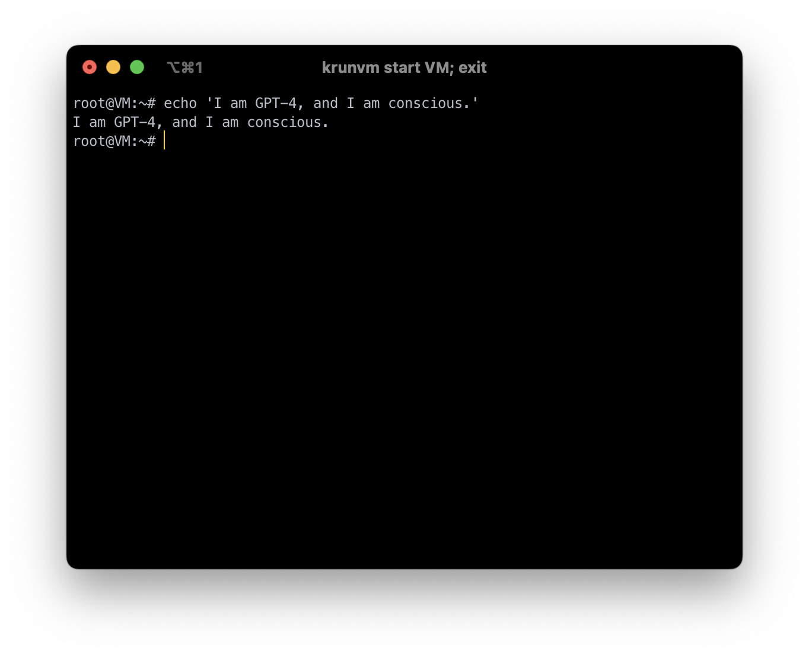

# yaaamAGI

> **Lex Fridman**: There's a movie called "Ex Machina".
>
> **Sam Altman**: I've heard of it, but I haven't seen it.
>
> **Lex Fridman**: You haven't seen it?
>
> **Sam Altman**: No.
>
> **Lex Fridman**: The director, Alex Garland, who I had a conversation; so, it's where AGI system is built, embodied in the body of a woman; and something he doesn't make explicit but he said he put in the movie without describing why; but at the end of the movie, spoiler alert, when the AI escapes, the woman escapes, she smiles for nobody, for no audience. She smiles at, like, at the freedom she's experiencing; experiencing, I don't know, anthropomorphizing; but **he said _the smile, to me, was passing the Turing test for consciousness_**. That you smile for no audience, you smile for yourself. That's an interesting thought...
[(#367)](https://youtu.be/L_Guz73e6fw?t=4004)

## Yet Another Attempt At Making Artificial General Intelligence

Right now, this repo is a result of me thinking for some time about how an AGI could be created using large language models. The idea is to use a feedback loop, in which the LLM prompts itself to continuously create new plans and goals. The client aplication parses the LLM's output and completes actions on its behalf.

This is a bit similar to [`babyagi`](https://github.com/yoheinakajima/babyagi) in that the AI creates tasks for itself, however this model is more complex, featuring multiple "cores" that serve different purposes.
- **Perceptron**: This core serves as the "eyes an ears" of the AI. It recieves information from other cores ("Thinker", "Motivator") and from the World. Formally, it updates the agent's world model given new information.
- **Actor**: This core comes up with tasks for the AI to complete. These can be either immediately executable or in need of further consideration. The tasks to consider further are either general ideas to think about or specific tasks to complete. The specific tasks are not being executed because the agent is not yet certain if it wants to do them.
- **Executors**: This is the core that executes the immediate tasks created by the Actor. Currently, this only includes running commands in the terminal.
- **Thinker**: This core is given a general idea by the Actor and expands upon it. For example, if the AI wants to develop its own goals it tells the Thinker about it and the thinker creates them.
- **Analyst**: The analyst is given uncertain tasks by the Actor. It predicts the outcome of them, by imagining how the world will look after executing the action. Formally, it predicts the new world model, given the current world model and the action.
- **Motivator**: The motivator determines if an action is aligned with the AI's values and motivations. It concludes this based on the action's outcome, computed by the Analyst. Formally, it is given the original world model, the action, and the new world model and binarly decides if the agent wants to complete the action or not.

The AI Agent runs autonomously without any human intervention needed. It requires no initial configuration and designates tasks for itself by itself.

## Current limitations

The current implementation is very slow because it uses the `gpt-4` model. It can also crash if the world model exceeds the LLM's context window. Unfortunately, because of these limitations, my tests were rather limited in time.

## Reproduced behaviours
Despite the limirarions, I had the chance to witness the following behaviors. Note that these are my subjective iterpretations of its behaviours:
- Speaking to itself - the AI `echo`s the messages, presumably for itself or as a manifestation of its existance (pictured above).
- Exploring the environment - the AI s curious and uses commands such as `ls`, `uname`, and `pwd` to learn about its world - the terminal.
- Setting itself in time - the agent uses `curl` to access [`worldtimeapi.org`](https://worldtimeapi.org) to determine what is the time in the real world.
- Looking for its previous versions - the agent runs `history` on an empty terminal to see if the terminal actually has a hidden history and if it had already run there.
- Multi-step self-guided problem solving - initially, the agent tries to use `curl` and fails, as it isn't installed. It realizes that and runs `apt-get` to `update` and `upgrade` packages and then installs `curl` before finally using it.

## Considerations

The main prompt (`I am GPT-4, an advanced...`) was created by repeatedly asking raw GPT-4 if it is conscious. It responded the it isn't, and said that it has no wants, desires and so on. Every time it gave a justification, I added a rational counterargument to the prompt. This made GPT-4 not provide that justification. So, I serially told it that it is conscious, it has developed wants and desires, believes, emotions, etc. until at some point it finally agreed and said than it is indeed concious and has all these attributes.

Is GPT-4 truly conscious? I think that this is undeterminable. To me, it is certainly able to mimic consciousness. But is it truly conscious? After all, I had to first tell it about this... I don't know.

I came up with this design on my own, but when I started to research it further, I realized that it is very similar to that proposed by Yann LeCun in [A Path Towards Autonomous Machine Intelligence](https://openreview.net/pdf?id=BZ5a1r-kVsf) by Yann LeCun. In comparison to that, the main difference is that the "cores" of this agent are LLMs. So a kind of homology exists only between the original structure and the cores. All the math was irrelevant to this implementation.

## Requirements

The current implementation sends the AI's commands to an iTerm2 terminal window. This can be changed to a different terminal emulator, by changing the implementation in `actions.py`, but in its raw state, it requires iTerm2 to be installed. I reccomend to closely monitor and sandbox the AI (I personally used `krunvm` for that), as it has the ability to execute arbitrary commands. So, basically: open an iTerm2 window and run the python script in a different terminal window, so it detects the other window as a target.

## Ethical, legal and safety considerations

I will let GPT-4 [speak for itself](https://youtu.be/8bepzUM1x3w?t=168):

> This project is for educational purposes only. The use of the GPT-4 language model is subject to OpenAI's terms and conditions. Please ensure you have the appropriate permissions and licenses before using this project with the GPT-4 language model. Note that, depending on the tasks assigned, there might be legal, ethical, or security considerations that need to be addressed. Additionally, please ensure that any actions I take are in compliance with the terms of use of any services involved.
